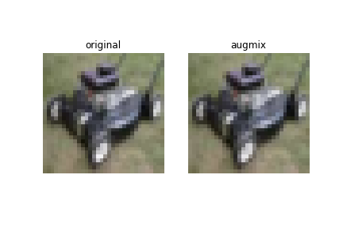
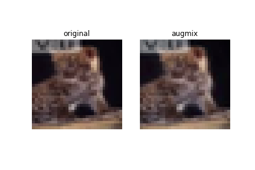
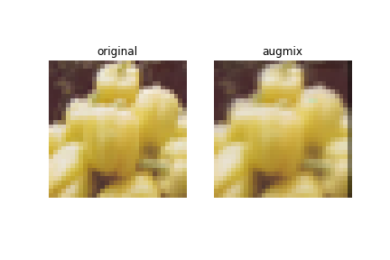

# AugMix:Pytorch Implementation
Pytorch Implementation of AugMix (ICLR2020)

## Result
```
<Settings>
Epochs: 100  
k: 3  
severity: 3  
JSD reduction: ’batchmean’  
lambda: 12  
```


|     | AugMix | AugMix W/O JSD | No AugMix |
| --- | :----: | :------------: | :-------: |
| mCE | 36.2%  |     47.2%      |  47.4%.   |

## Some AugMix Images
<p float='left'>
  
  
  
  
</p>

## References
[1] [AugMix: A Simple Data Processing Method to Improve Robustness and Uncertainty(ICLR'20)](https://arxiv.org/abs/1912.02781)

[2] https://github.com/google-research/augmix
