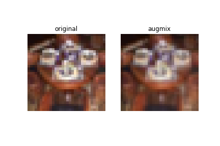

# AugMix:Pytorch Implementation
Pytorch Implementation of AugMix (ICLR2020)

## What is AugMix?
AugMix is an abbreviation for Augmentation and Mix. In machine learning, augmentation is the technique to increase the diversity of data available for training model by slightly modifying training data. Modern deep neural networks can achieve high accuracy when the training distribution and test distribution are identically distributed, but this assumption is frequently violated in practice. In this paper, authors propose AugMix, a data preprocessing technique which improves model robustness and uncertainty using augmentation.  


## Realization of AugMix

| AugMix | Cascade of successive compositions |
| ------ | ------------ |
|  |    |  

A cascade of successive compositions can produce images which drift far from the original image, and lead to unrealistic images. But, AugMix use the parallel connection of augmentation operations, so it can produce a new image without veering too far from the original.


## Pseudocode of AugMix

Jensen-Shannon Divergence can be understood to measure how similar the distributions of original, augmix1 and augmix2 are.


## Result
I trained CIFAR-100 with augmix and then measured mCE(mean Corruption Error) of CIFAR-100-C.
```
<Settings>
Epochs: 100  
k: 3  
severity: 3  
JSD reduction: ’batchmean’  
lambda: 12  
```


|     | AugMix W/ JSD | AugMix W/O JSD | No AugMix |
| --- | :----: | :------------: | :-------: |
| mCE | 36.2%  |     47.2%      |  47.4%.   |

 

## Some AugMix Images
<p float='left'>
  
  
  
  
</p>

## To train
#### AugMix
`python3 main.py`  
#### AugMix without JSD loss
`python3 main.py --wo_jsd`  
#### No AugMix
`python3 main.py --no_jsd`

## To test
`python3 main.py --test --path {.ckpt file what you want to test}`

## References
[1] [AugMix: A Simple Data Processing Method to Improve Robustness and Uncertainty(ICLR'20)](https://arxiv.org/abs/1912.02781)

[2] https://github.com/google-research/augmix
